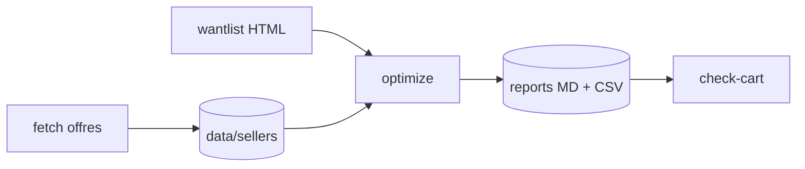

# MKM Optimizer

**Outil CLI qui transforme une wantlist Cardmarket et une liste de vendeurs en paniers d'achat optimisés minimisant le coût total (cartes + frais de port), à usage strictement personnel.**


## Architecture

Quatre étapes indépendantes, une par sous-commande, communiquant par fichiers
sur disque (HTML bruts, rapports) :

- `login` — session Playwright persistée dans `.auth/storage_state.json`
- `fetch` — scraping paginé des offres vendeurs → `data/sellers/<v>/page<N>.html`
- `optimize` — parsing + compatibilité par want + solveur MIP exact (PuLP + CBC), un panier par scénario → `reports/`
- `check-cart` — comparaison du panier construit sur MKM avec le rapport



> Détails : [docs/ARCHITECTURE.md](docs/ARCHITECTURE.md) (le COMMENT) et
> [docs/CADRAGE.md](docs/CADRAGE.md) (le POURQUOI).

## Documentation

| Document | Contenu |
|---|---|
| [docs/CADRAGE.md](docs/CADRAGE.md) | Pitch, périmètre V1/hors-V1, hypothèses, décisions, roadmap |
| [docs/ARCHITECTURE.md](docs/ARCHITECTURE.md) | Composants, flux, modèle MIP, configuration, sécurité, limites |

## Pourquoi cet outil

Le Shopping Wizard natif de Cardmarket gère mal :

- Le **split de quantité** entre vendeurs (prendre 2× chez A + 1× chez B + 1× chez C
  si c'est globalement plus économique en tenant compte des frais de port)
- Le **mélange d'éditions** sur les "metacards" (édition indifférente) — la même
  carte peut venir de 4 sets différents si c'est le moins cher
- Les **scénarios multiples** (min vendeurs vs min prix vs équilibre)
- La gestion fine des frais de port en paliers (€1-20 cartes, €20-50, €50-100)

Cet outil les gère tous, via un solveur de programmation linéaire en nombres
entiers (MIP) qui garantit l'optimum mathématique exact.

## Pile technique

- **Python 3.11+**
- **Playwright** (Chromium) pour scraper Cardmarket avec une session
  authentifiée (storage_state persisté)
- **selectolax** (parsing HTML rapide, ~10× BeautifulSoup)
- **PuLP + CBC** pour le solveur MIP exact
- **typer + rich** pour le CLI

Aucune utilisation de l'API officielle MKM (réservée aux vendeurs pros).

## Installation

```bash
# 1. Clone / cd dans le projet
cd /home/florian/mes_projets/cardmarket-wantlist-optimizer

# 2. Crée l'environnement + installe les deps (gérées par uv via pyproject.toml + uv.lock)
uv sync

# 3. Télécharge Chromium pour Playwright
uv run playwright install --with-deps chromium
```

## Configuration

### `.env` (credentials Cardmarket — non versionné)

```bash
cp .env.example .env
# puis édite .env avec ton identifiant et mdp MKM
```

Le fichier `.env` n'est **jamais** committé (présent dans `.gitignore`). Les
credentials ne servent qu'à pré-remplir le formulaire de login Chromium ; ils
ne transitent par aucun fichier sauvegardé après login.

### `config.yaml` (paramètres d'optimisation)

```yaml
filters:
  excluded_sellers: []      # pseudos avec qui on refuse de traiter
  max_offer_price: 20       # plafond de prix unitaire (€) ; null = pas de plafond
  # min_condition / languages / foil / seller_country : conservés pour
  # référence mais NON appliqués globalement — chaque want porte ses propres
  # filtres parsés depuis ta wantlist MKM.

shipping:
  brackets:                  # paliers FDP (FR par défaut, suivi obligatoire)
    - { max_cards: 20,  cost: 3.60 }
    - { max_cards: 50,  cost: 6.00 }
    - { max_cards: 100, cost: 8.00 }

optimization:
  scenarios:                # un panier optimisé est produit pour chaque
    - { name: "max_3_vendeurs", max_vendors: 3 }
    - { name: "max_4_vendeurs", max_vendors: 4 }
    - { name: "max_5_vendeurs", max_vendors: 5 }
    - { name: "min_prix",       max_vendors: null }   # illimité
```

### `data/vendeurs_liste/vendeurs.yaml` (liste des vendeurs à scraper)

```yaml
wantlist_id: 23837361

sellers:
  - CORP-F
  - Cartapapa-GP
  - FMR-cards
  # ... un pseudo par ligne, sensible à la casse
```

## Quick Start

```bash
# 1. Connexion MKM (1 seule fois, valide ~30 jours)
uv run mkm-optim login

# 2. Scrape les vendeurs (--refresh si ta wantlist a changé)
uv run mkm-optim fetch --refresh

# 3. Génère le rapport d'optimisation
uv run mkm-optim optimize \
  --wantlist data/wantlists/Wantlist.html \
  --sellers-dir data/sellers \
  --config config.yaml

# 4. Fais ton panier sur MKM, sauvegarde-le avec SingleFile
#    → data/panier/Panier.html

# 5. Vérifie ton panier vs le rapport
uv run mkm-optim check-cart \
  --scenario max_7_vendeurs
```

## Workflow type

```text
1. Sauvegarde ta wantlist MKM (page /Wants/<id>) avec l'extension SingleFile
   → data/wantlists/Wantlist.html
2. Lance `mkm-optim login` (1 fois, ouvre Chromium pour la connexion)
3. Lance `mkm-optim fetch --refresh` (scrape les vendeurs listés dans data/vendeurs_liste/vendeurs.yaml)
4. Lance `mkm-optim optimize` (produit le rapport)
5. Construis ton panier sur MKM, sauvegarde-le avec SingleFile
   → data/panier/Panier.html
6. Lance `mkm-optim check-cart` (vérifie le panier vs le rapport)
```

## Commandes

### `login` — connexion à Cardmarket

```bash
uv run mkm-optim login
```

Ouvre Chromium (headed via WSLg sur Windows 11). Si `.env` est rempli, les
champs sont pré-remplis et soumis automatiquement. Sinon, mode interactif.
La session est sauvegardée dans `.auth/storage_state.json` (gitignored,
valide ~30 jours).

### `fetch` — récupération des offres vendeurs

```bash
# Scrape tous les vendeurs de data/vendeurs_liste/vendeurs.yaml (skippe ceux déjà en cache)
uv run mkm-optim fetch

# Force le re-scrape (utile si la wantlist a changé)
uv run mkm-optim fetch --refresh

# Tester sur un seul vendeur (ex : debug)
uv run mkm-optim fetch --only CORP-F --refresh
```

Chaque page d'offres est sauvegardée dans `data/sellers/<pseudo>/page<N>.html`.
Rate limit configurable (800-1500 ms par défaut), retry 3× avec backoff sur
les HTTP 429/503 et erreurs réseau. Si la session expire en cours de scraping,
le fetch s'arrête proprement et affiche la marche à suivre.

**Resume intelligent** : si le fetch est interrompu (réseau, throttle MKM), il
reprend automatiquement à la première page manquante au prochain run, sans
re-scraper les pages déjà en cache.

### `optimize` — génération du rapport optimisé

```bash
uv run mkm-optim optimize \
  --wantlist data/wantlists/wants_23837361.html \
  --sellers-dir data/sellers \
  --config config.yaml
```

Produit dans `reports/` :

- `YYYY_MM_DD_HH-MM_WantListOptimized.md` — rapport lisible (tableau
  comparatif des scénarios en intro, puis détail par vendeur avec sous-totaux,
  FDP, et section « Wants entièrement non couverts » à la fin)
- `YYYY_MM_DD_HH-MM_WantListOptimized.csv` — version plate pour tableur
- `YYYY_MM_DD_HH-MM_WantList.csv` — dump CSV de ta wantlist (audit)

### `wantlist-csv` — export wantlist seul

```bash
uv run mkm-optim wantlist-csv \
  --wantlist data/wantlists/wants_23837361.html \
  --output reports/ma_wantlist.csv
```

Utile pour vérifier ce que le parser comprend de ta wantlist sans lancer
toute l'optimisation.

### `check-cart` — vérification du panier vs rapport

```bash
# Utilise automatiquement le dernier rapport CSV dans reports/
uv run mkm-optim check-cart \
  --scenario max_7_vendeurs

# Préciser explicitement le rapport et le panier
uv run mkm-optim check-cart \
  --cart data/panier/Panier.html \
  --report reports/2026_05_27_22-06_WantListOptimized.csv \
  --scenario max_7_vendeurs
```

Compare le panier Cardmarket (sauvegardé avec SingleFile depuis `/fr/Magic/ShoppingCart`)
avec le scénario choisi dans le rapport d'optimisation. Produit dans `reports/` :

- `YYYY_MM_DD_HH-MM_CartCheck_<scenario>.md` — rapport Markdown listant :
  - tableau récap (cartes, total €, écart rapport/panier)
  - vendeurs manquants ou en trop
  - par vendeur : cartes manquantes, en trop, quantités incorrectes, prix et éditions différents

### `parse` — debug parsing d'un HTML (wantlist ou page vendeur)

```bash
uv run mkm-optim parse path/vers/page.html
```

Auto-détecte le type. Affiche les 30 premières entrées à la console.

## Comment fonctionne l'optimisation (résumé)

Pour chaque scénario (max N vendeurs), on construit un MIP avec :

- **Variables**
  - `z[o, w]` (entier) = nb d'exemplaires de l'offre `o` attribués au want `w`
  - `x[v]` (binaire) = vendeur `v` est-il sélectionné
  - `y[v, k]` (binaire) = palier de FDP `k` actif chez `v`
  - `u[w]` (entier) = nb d'exemplaires non couverts (slack)
- **Contraintes**
  - Demande : pour chaque want, somme des `z` + slack = quantité voulue
  - Stock : pour chaque offre, somme des `z` ≤ stock vendeur
  - Activation : si on achète chez `v`, alors `x[v] = 1`
  - Palier unique : exactement un palier de FDP par vendeur sélectionné
  - Plafond : `Σ x[v] ≤ max_vendeurs`
- **Objectif**
  - Minimiser : coût des cartes + FDP + (pénalité géante × cartes non couvertes)

La pénalité géante (10 000 €/carte) garantit qu'un want est laissé non
couvert uniquement s'il n'existe **aucune offre compatible**. Sinon le
solveur préfère toujours couvrir.

Le solveur CBC est **déterministe** : même input → même output, pas de seed.
Si tu veux des solutions différentes, ajuste `max_vendors`, les filtres ou
la liste des vendeurs.

## Architecture du code

```
src/mkm_optimizer/
├── cli.py                # Entry point (typer) : login, fetch, optimize, parse, wantlist-csv
├── config.py             # Chargement config.yaml + config.local.yaml
├── models.py             # Dataclasses : WantEntry, Offer, Solution, etc.
├── selectors.py          # TOUS les sélecteurs CSS / tables FR↔EN centralisés
├── filters.py            # Pré-filtres globaux (excluded_sellers, max_offer_price)
├── reporter.py           # Génération MD + CSV des rapports
├── wantlist_export.py    # Export CSV de la wantlist (audit)
├── parser/
│   ├── wantlist.py       # Parse page /Wants/<id> → list[WantEntry]
│   └── seller_offers.py  # Parse pages /Users/<v>/Offers + pagination
├── scraper/              # Playwright : login + fetch paginé
│   ├── auth.py           # Soumission du login, fallback ENTRÉE si le clic
│   │                     # sur le bouton submit est intercepté (bannière cookies)
│   └── fetch.py
└── optimizer/
    ├── compat.py         # is_compatible(offer, want)
    └── mip.py            # Solveur PuLP + CBC
```

## Tests

Deux scripts *smoke* (pas encore une suite pytest) :

```bash
uv run python tests/smoke_mip.py       # solveur : cas synthétique + données réelles
uv run python tests/smoke_parsers.py   # parsers wantlist + offres sur HTMLs réels
```

## Dépannage

### Le login dit "Aucun marqueur de connexion détecté"

Soit la session MKM est OK et c'est juste un faux warning (vérifie avec un
fetch test), soit Cloudflare a affiché un CAPTCHA que tu n'as pas résolu.
Relance `mkm-optim login` et termine bien la connexion dans la fenêtre
Chromium avant d'appuyer Entrée dans le terminal.

### Le login se bloque sur le clic du bouton submit

Si la bannière cookies (Cybot) recouvre encore le bouton au moment du login
automatique, le clic échoue par timeout. Dans ce cas, `login` bascule
automatiquement sur un appui ENTRÉE dans le champ mot de passe, qui soumet le
formulaire sans dépendre de la position du bouton. Si ça échoue aussi, le
mode interactif prend le relais.

### `RuntimeError: Session expirée ou invalide`

MKM a invalidé la session côté serveur (timeout ou rotation). Relance
`mkm-optim login`, puis ton `fetch`.

### `net::ERR_NETWORK_CHANGED`

Ton lien réseau (Wi-Fi, VPN, économie d'énergie) a bougé. Le code retry
automatiquement, mais si ça persiste, passe en Ethernet, désactive
l'économie d'énergie carte réseau, et tente à nouveau. Le fetch reprend
automatiquement où il s'était arrêté.

### Un vendeur retourne `404` ou `navigation_failed`

Typo dans `data/vendeurs_liste/vendeurs.yaml` ou MKM throttle ce vendeur précisément. Vérifie
le pseudo (sensible à la casse), retente plus tard avec
`--only <PSEUDO>`.

### Le rapport dit "non couvert" pour une carte que je sais en stock

C'est probablement :

1. **Le vendeur n'a pas été scrapé** (pas dans `data/vendeurs_liste/vendeurs.yaml`, ou échec
   du fetch). Vérifie : `grep -l "<nom_carte>" data/sellers/<v>/*.html`
2. **La wantlist a changé après le fetch** : la nouvelle carte n'était
   pas dans le filtre `?idWantslist=` au moment du scrape → `--refresh`
   les vendeurs concernés.
3. **Bug réel** : copie le nom exact de la carte et reporte, on debug.

## Limitations connues

- **Pas de scraping FDP automatique** : les frais de port sont configurés
  globalement dans `config.yaml` (mêmes paliers pour tous les vendeurs).
  La modélisation par vendeur reste à implémenter.
- **Pas d'heuristique gourmande de fallback** : le MIP exact suffit
  largement jusqu'à ~150 wants × 5000 offres. Au-delà, le solveur peut
  ralentir.
- **`max_price` du want non utilisé en contrainte dure** : le solveur peut
  prendre une carte au-dessus du prix souhaité si c'est globalement optimal.
  La colonne PxD du rapport te le signale visuellement.
- **Pas de découverte automatique de vendeurs** : tu maintiens la liste à
  la main dans `data/vendeurs_liste/vendeurs.yaml`.

## Conformité et risques

- Les conditions générales de Cardmarket interdisent en pratique le scraping
  automatisé hors API officielle.
- L'outil est strictement à usage personnel, sur un compte personnel, avec
  un rate limit respectueux (800-1500 ms entre requêtes).
- Le risque de bannissement temporaire (2-24h) existe mais reste faible
  pour un usage modéré. L'utilisateur assume ce risque.
- Aucun contournement de CAPTCHA / protection anti-bot n'est tenté. Si
  Cardmarket bloque, le scraping s'arrête.

---

## Licences & composants

| Composant | Rôle | Licence |
|---|---|---|
| PuLP | Solveur MIP (optimisation) | MIT |
| CBC (via PuLP) | Solveur linéaire embarqué | EPL-2.0 |
| selectolax | Parsing HTML des pages MKM | MIT |
| Pydantic | Modèles de données typés | MIT |
| Typer | Interface en ligne de commande | MIT |
| Rich | Affichage CLI / logs | MIT |
| PyYAML | Configuration | MIT |
| python-dotenv | Chargement des credentials `.env` | BSD-3-Clause |
| **Ce projet** | Code applicatif | MIT — Copyright (c) 2026 floSa `<à confirmer : aucun fichier LICENSE présent>` |

> Les données proviennent de Cardmarket (MKM) ; leur usage reste soumis aux conditions de la
> plateforme (usage personnel).
