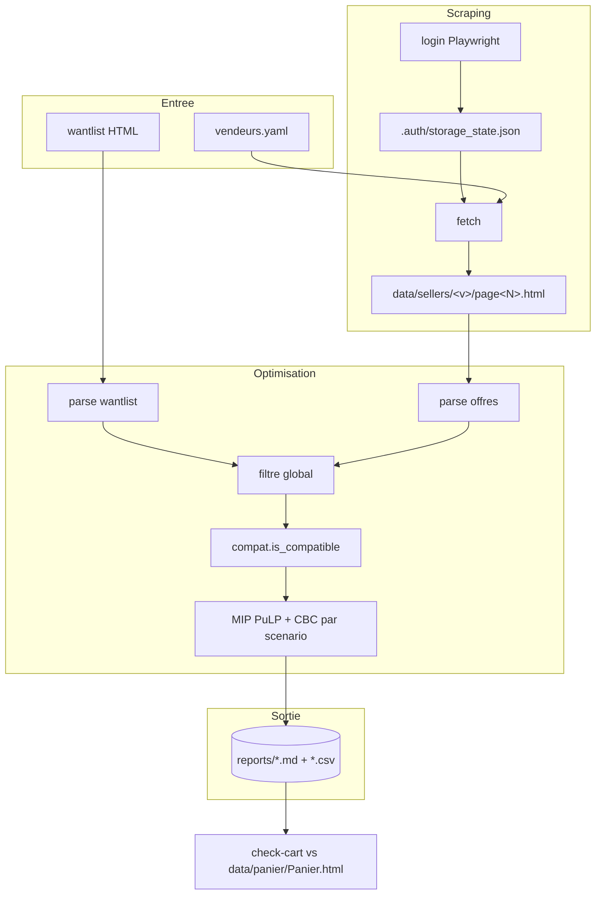

# Architecture — MKM Optimizer

Le COMMENT du projet. Pour le POURQUOI (objectifs, périmètre, décisions de
cadrage), voir [CADRAGE.md](CADRAGE.md).

## 1. Vue d'ensemble

MKM Optimizer est un outil en ligne de commande Python (src-layout, package
`mkm_optimizer`). Il transforme une **wantlist Cardmarket** (page HTML) et un
ensemble de **pages d'offres vendeurs** (HTML) en **paniers d'achat optimisés**,
un par scénario, écrits en Markdown et CSV dans `reports/`.

Le flux se décompose en quatre étapes indépendantes, chacune exposée par une
sous-commande : récupération de session (`login`), scraping des offres
(`fetch`), optimisation (`optimize`), vérification a posteriori du panier
construit sur le site (`check-cart`). Les étapes communiquent par des fichiers
sur disque (HTML bruts, rapports), jamais par un service tournant.

---

## 2. Composants

Tout le code vit sous [src/mkm_optimizer/](../src/mkm_optimizer).

| Module | Rôle |
|---|---|
| [cli.py](../src/mkm_optimizer/cli.py) | Point d'entrée Typer. Commandes `optimize`, `fetch`, `login`, `parse`, `wantlist-csv`, `check-cart`. |
| [config.py](../src/mkm_optimizer/config.py) | Chargement `config.yaml` + surcharge récursive par `config.local.yaml` (gitignored). |
| [models.py](../src/mkm_optimizer/models.py) | Dataclasses typées (`WantEntry`, `Offer`, `Seller`, `ShippingBracket`, `Assignment`, `VendorBasket`, `Solution`) et enums `Condition` / `Foil`. Prix en `Decimal`. |
| [selectors.py](../src/mkm_optimizer/selectors.py) | Sélecteurs CSS et tables de correspondance FR↔EN, centralisés. |
| [filters.py](../src/mkm_optimizer/filters.py) | Pré-filtre global des offres. N'applique aujourd'hui que `excluded_sellers`. |
| [overrides.py](../src/mkm_optimizer/overrides.py) | Applique `wantlist_overrides.yaml` (corrections locales de la wantlist). |
| [reporter.py](../src/mkm_optimizer/reporter.py) | Génération des rapports Markdown + CSV d'optimisation. |
| [wantlist_export.py](../src/mkm_optimizer/wantlist_export.py) | Export CSV brut d'une wantlist (audit). |
| [cart_checker.py](../src/mkm_optimizer/cart_checker.py) | Compare un panier MKM (HTML SingleFile) au rapport d'un scénario. |
| [parser/wantlist.py](../src/mkm_optimizer/parser/wantlist.py) | Parse la page `/Wants/<id>` → `list[WantEntry]` + métadonnées. |
| [parser/seller_offers.py](../src/mkm_optimizer/parser/seller_offers.py) | Parse les pages `/Users/<v>/Offers` + pagination → `list[Offer]`. |
| [scraper/auth.py](../src/mkm_optimizer/scraper/auth.py) | Login Playwright, persistance de session dans `.auth/storage_state.json`. |
| [scraper/fetch.py](../src/mkm_optimizer/scraper/fetch.py) | Récupération paginée des offres, rate limit, backoff, resume. |
| [optimizer/compat.py](../src/mkm_optimizer/optimizer/compat.py) | `is_compatible(offer, want)` : contraintes dures (nom, set, état, langue, foil, signed, altered). |
| [optimizer/mip.py](../src/mkm_optimizer/optimizer/mip.py) | Solveur exact PuLP + CBC : `solve(...)` → `Solution`. |

---

## 3. Stack technologique

Versions lues dans [pyproject.toml](../pyproject.toml).

| Couche | Technologie | Version |
|---|---|---|
| Langage | Python | ≥ 3.11 |
| Gestion de paquets | uv (via `pyproject.toml` + `uv.lock`) | — |
| Solveur MIP | PuLP (CBC embarqué) | ≥ 2.8 |
| Parsing HTML | selectolax | ≥ 0.3.21 |
| Modèles de données | Pydantic | ≥ 2.6 |
| CLI | Typer | ≥ 0.12 |
| Affichage | Rich | ≥ 13.0 |
| Config | PyYAML | ≥ 6.0 |
| Credentials | python-dotenv | ≥ 1.0 |
| Scraping (extra `scrape`) | Playwright (Chromium) | ≥ 1.42 |
| Tests / lint (extra `dev`) | pytest ≥ 8.0, ruff ≥ 0.4 | — |

---

## 4. Flux de bout en bout

1. `login` — ouvre Chromium (headed par défaut, WSLg sur Windows 11), pré-remplit
   le formulaire MKM si `.env` est présent, persiste la session dans
   `.auth/storage_state.json` (valide ~30 jours).
2. `fetch` — pour chaque vendeur de `data/vendeurs_liste/vendeurs.yaml`, navigue
   sur `/Users/<v>/Offers/Singles?idWantslist=<id>` (filtre natif MKM), suit la
   pagination, sauvegarde chaque page dans `data/sellers/<pseudo>/page<N>.html`.
   Rate limit aléatoire, backoff sur HTTP 429/503, resume sur la première page
   manquante.
3. `optimize` — parse la wantlist et les HTMLs vendeurs, applique les overrides
   locaux et le pré-filtre global, puis résout un MIP **par scénario** et écrit
   les rapports.
4. Construction manuelle du panier sur MKM, sauvegardé avec l'extension
   SingleFile → `data/panier/Panier.html`.
5. `check-cart` — compare ce panier au scénario choisi du dernier rapport CSV et
   liste les divergences.



---

## 5. Modèle d'optimisation (MIP)

Coeur du projet, dans [optimizer/mip.py](../src/mkm_optimizer/optimizer/mip.py).
Pour chaque scénario, on construit et résout un programme linéaire en nombres
entiers avec CBC.

**Variables**

| Variable | Domaine | Sens |
|---|---|---|
| `z[o,w]` | entier ≥ 0, ≤ stock(o) | exemplaires de l'offre `o` attribués au want `w` |
| `x[v]` | binaire | vendeur `v` sélectionné |
| `y[v,k]` | binaire | palier de FDP `k` actif chez `v` |
| `u[w]` | entier ≥ 0, ≤ qty(w) | exemplaires non couverts (slack) |

Seules les paires `(o, w)` compatibles (`is_compatible`) génèrent une variable
`z`, ce qui borne la taille du problème.

**Contraintes**

1. Demande : pour chaque want, `Σ_o z[o,w] + u[w] = qty(w)`.
2. Stock : pour chaque offre, `Σ_w z[o,w] ≤ stock(o)`.
3. Activation (big-M) : `Σ z chez v ≤ M_v · x[v]`, avec `M_v` = stock total chez `v`.
4. Palier unique : `Σ_k y[v,k] = x[v]`.
5. Capacité palier : `n_v ≤ Σ_k max_cards_k · y[v,k]`.
6. Plafond vendeurs : `Σ_v x[v] ≤ max_vendors` (si le scénario le fixe).

**Objectif** — minimiser :

```
Σ z[o,w]·prix(o)  +  Σ y[v,k]·cost_k  +  PENALTY·Σ u[w]  +  Σ x[v]·vendor_fixed_cost
```

- `PENALTY = 10 000 €/carte` (`DEFAULT_UNMET_PENALTY`) : un want n'est laissé non
  couvert que s'il n'existe **aucune** offre compatible.
- `vendor_fixed_cost` (0 par défaut) : coût fictif par vendeur, en plus du FDP
  réel, pour obtenir un panier frugal en nombre de vendeurs.
- CBC est déterministe (`timeLimit=60 s`) : même entrée → même sortie, sans seed.

Le test de compatibilité ([compat.py](../src/mkm_optimizer/optimizer/compat.py))
gère nom normalisé (accents, variantes `(V.N)`), metacards (édition
indifférente), rang d'état (`MT < NM < … < PO`), langue, foil, signed, altered.
Le **prix n'intervient pas** dans la compatibilité : il n'est traité que par
l'objectif.

---

## 6. Configuration

`config.yaml` à la racine, surchargeable par `config.local.yaml` (gitignored,
merge récursif dans [config.py](../src/mkm_optimizer/config.py)).

| Clé | Rôle |
|---|---|
| `wantlist.default_id` | ID de la wantlist MKM par défaut. |
| `filters.excluded_sellers` | Pseudos toujours ignorés (seul filtre global effectif). |
| `filters.min_condition` / `languages` / `foil` / `seller_country` / `seller_type` / `min_reputation` | Conservés pour référence mais **non appliqués globalement** (voir §Décisions). |
| `shipping.brackets` | Paliers de FDP (`max_cards` / `cost`), barème unique tous vendeurs. |
| `optimization.scenarios` | Liste des scénarios générés (`name`, `max_vendors`, `vendor_fixed_cost`). |
| `optimization.exact_threshold` | Seuils au-delà desquels basculer sur une heuristique (non implémentée). |
| `cache` / `rate_limit` | Paramètres du scraping Playwright. |

Scénarios réels de `config.yaml` : `max_3_vendeurs`, `max_5_vendeurs`,
`max_6_vendeurs`, `max_7_vendeurs`, et `min_prix_min_vendeurs`
(`max_vendors: null`, `vendor_fixed_cost: 10`).

Credentials : `.env` (jamais committé, cf. `.env.example`) avec
`CARDMARKET_USER` / `CARDMARKET_PASS`, servant uniquement à pré-remplir le
formulaire de login.

---

## 7. Décisions d'architecture

- **Solveur MIP exact (PuLP + CBC)** plutôt qu'une heuristique gourmande, **parce
  que** le split de quantité, le mélange d'éditions et les paliers de FDP forment
  un problème combinatoire où l'optimum exact est atteignable jusqu'à
  ~150 wants × ~5000 offres. *Limite* : au-delà, le solveur peut ralentir ;
  l'heuristique de fallback (`exact_threshold`) reste à implémenter.

- **Slack `u[w]` avec pénalité géante** plutôt qu'un modèle infaisable quand une
  carte manque, **parce que** cela garantit toujours une solution et remonte
  proprement les wants non couverts. *Limite* : un `PENALTY` mal calibré
  masquerait un vrai arbitrage prix.

- **Filtres état/langue/foil déplacés au niveau du want** (`compat.is_compatible`)
  plutôt qu'en pré-filtre global (`filters.py`), **parce que** un filtre global
  créait des faux négatifs (un want `GD` bloqué par un `min_condition: EX`
  global). *Limite* : les clés `filters.*` de `config.yaml` restent présentes
  mais inertes, ce qui peut induire en erreur.

- **HTML sauvegardé sur disque + parsing découplé** plutôt qu'un scraping
  parse-à-la-volée, **parce que** cela permet de rejouer l'optimisation sans
  re-scraper et de déboguer un parser sur un HTML figé. *Limite* : les HTML
  vendeurs sont lourds (10-20 Mo) et non versionnés.

- **selectolax** plutôt que BeautifulSoup pour le parsing, **parce que** ~10× plus
  rapide sur ces pages volumineuses. *Limite* : API moins riche.

- **Prix en `Decimal`** plutôt que `float`, **parce que** la sommation sur des
  dizaines d'articles accumule des erreurs d'arrondi en flottant. *Limite* :
  conversion en `float` nécessaire pour l'objectif PuLP.

---

## 8. Sécurité (récapitulatif)

| Durcissement | Effet |
|---|---|
| `.env` gitignored | Credentials MKM jamais committés. |
| `.auth/` gitignored | Session Playwright (cookies) hors du dépôt. |
| Rate limit 800-1500 ms + backoff | Scraping respectueux, réduit le risque de throttle/ban. |
| Aucun contournement de CAPTCHA | Le scraping s'arrête si MKM bloque. |
| Usage strictement personnel | Pas d'API officielle MKM (réservée aux pros). |

Le scraping automatisé hors API est déconseillé par les conditions de
Cardmarket ; l'usage reste personnel et l'utilisateur assume le risque de
bannissement temporaire. Détail dans le README (section « Conformité et
risques »).

---

## 9. Limites connues & pistes

| Aspect | Limitation / État | Piste |
|---|---|---|
| FDP par vendeur | Barème unique global dans `config.yaml` | Scraper les FDP réels par vendeur |
| Passage à l'échelle | Pas d'heuristique de fallback | Implémenter l'heuristique gourmande au-delà de `exact_threshold` |
| `max_price` du want | Non contraignant (le solveur peut dépasser) | Colonne PxD du rapport signale visuellement |
| Découverte de vendeurs | Liste maintenue à la main | Découverte automatique |
| `filters.*` non-globaux | Clés présentes mais inertes | Nettoyer ou brancher `seller_country`/`type`/`reputation` |
| Tests | Scripts smoke (`tests/smoke_*.py`), pas de suite pytest | Convertir en tests pytest |
